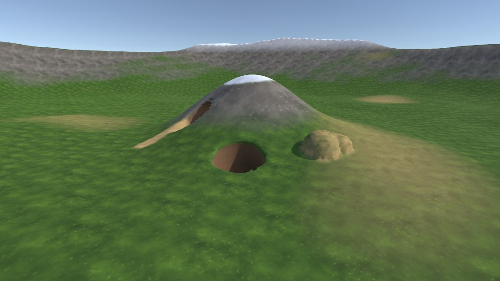
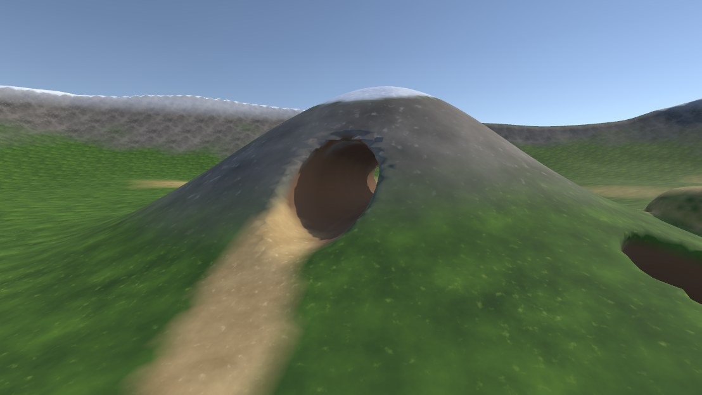
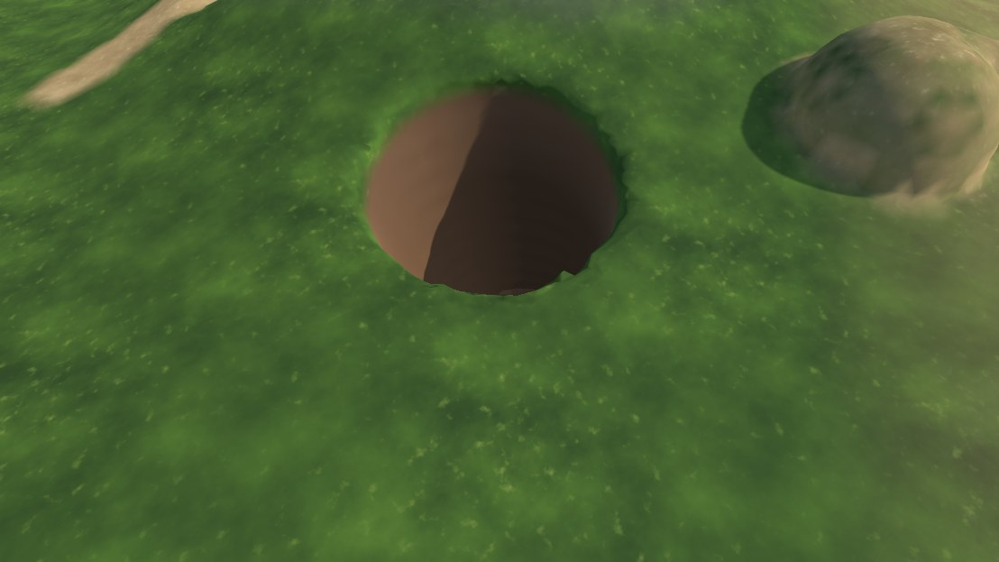
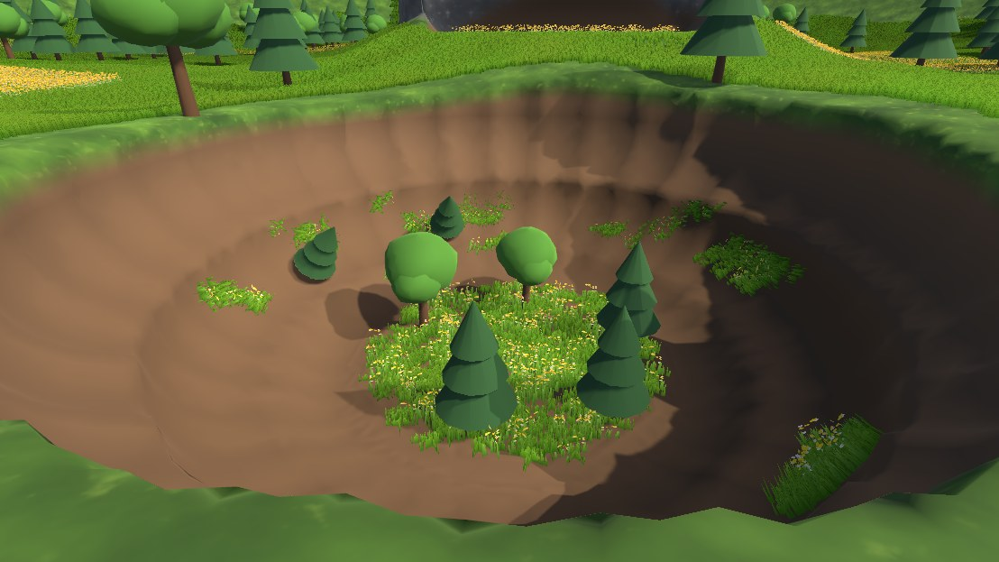
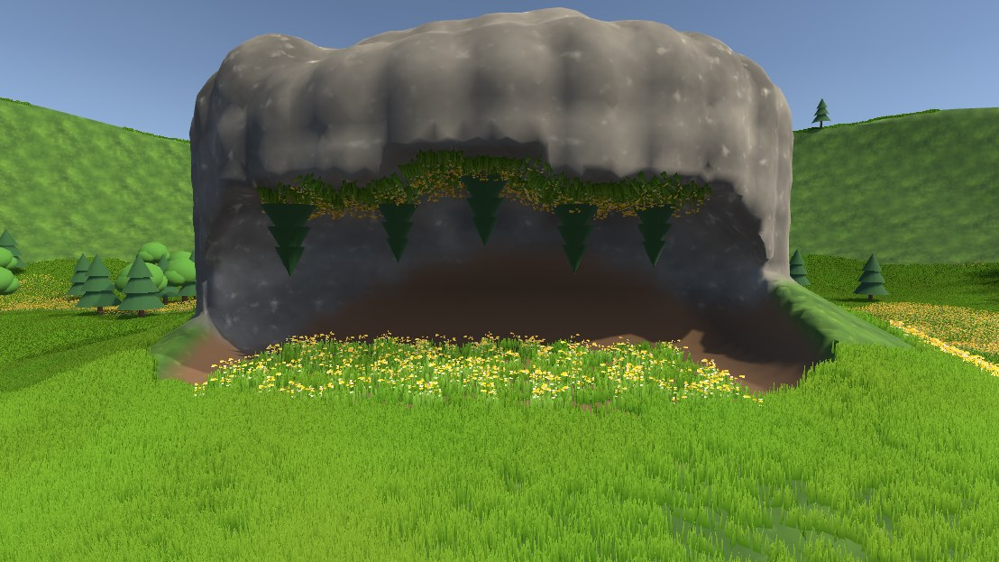
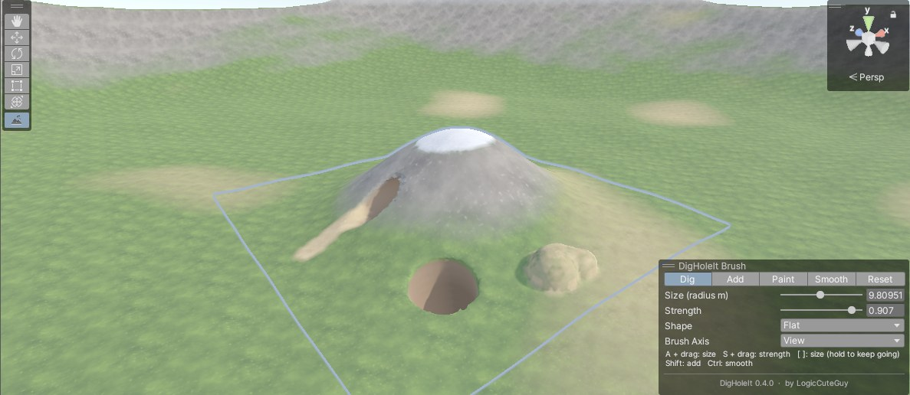
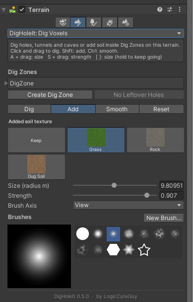

# DigHoleIt

Diggable voxel terrain for Unity, in the spirit of Digger Pro. Built for **VRChat worlds (LCGUdonSharp)** and usable in **standalone games**.



- Dig and add soil at runtime: holes, tunnels and caves under a normal Unity Terrain.
- Paint any of the terrain's layers (or dug soil) onto the voxel surface, at runtime and in the editor.
- In VRChat, edits sync to every player, including late joiners.
- Shading matches the terrain's own layers (as many as it has, up to 16), with a "dug soil" material underground.
- Works with baked lighting: chunks are lightmapped, and chunks dug at runtime switch to light probes.
- Terrain trees and details (grass, flowers, detail meshes) show inside zones and go away where the ground under them is dug or buried. Paint them into zones with the DigHoleIt: Paint Trees / Paint Details terrain tools.
- Terrain-style editor brushes: Dig, Add, Paint, Smooth and Reset, with shapes, size and strength.
- Zones follow the terrain: raise, lower or paint the terrain under a zone and it updates, keeping your sculpting. A bake raises the zone when the terrain reaches its top.
- Move and resize zones with box handles; re-baking keeps your sculpting.
- Grids are stored run-length compressed (a terrain grid shrinks to a few percent). In VRChat, players decode only the chunks that get dug, reset is instant, and only chunks with a surface have a GameObject, so large zones stay light.
- One brush and mesher implementation, shared by the Udon runtime and plain C#.

## Screenshots

| Tunnel through a hill | Dug pit and added soil |
|---|---|
|  |  |

**Painting inside holes.** DigHoleIt: Paint Trees and Paint Details reach into dug holes: trees and grass on a pit floor and its walls, and trees hanging from a cave ceiling with flowers growing on it:

| Trees and grass in a pit | Under a cave ceiling |
|---|---|
|  |  |

**Sculpting in the editor.** The Dig Sculpt tool, with its brush panel in the Scene view:



**From the Terrain.** The same brushes as a terrain tool, **DigHoleIt: Dig Voxels**, in the terrain's Paint Terrain list (here in Add mode, adding soil textured with the Grass layer):



## Requirements

| | VRChat world | Standalone game |
|---|---|---|
| Unity | 2022.3 | 2022.3 |
| Render pipeline | Built-in | Built-in |
| Other | VRChat Worlds SDK 3.10.5 and **LCGUdonSharp** 0.3.4 or later | none |

## Install

**VRChat Creator Companion (VCC):** add the LogicCuteGuy repository from [docs.logiccuteguy.com](https://docs.logiccuteguy.com/) (**Install via VCC**), or add this listing URL in *Settings > Packages > Add Repository*:

```
https://vpm.logiccuteguy.com/index.json
```

Then add **DigHoleIt** to your project. VCC also installs LCGUdonSharp with it. The listing may lag behind the newest GitHub release.

**Git URL:** *Window > Package Manager > + > Add package from git URL*:

```
https://github.com/LogicCuteGuy/DigHoleIt.git
```

Or clone this repository into your project's `Packages/com.logiccuteguy.digholeit` folder.

The package picks its runtime from the project. With the VRChat SDK only the Udon runtime compiles; without it only the standalone runtime does. To keep the standalone runtime in a VRChat project, add the scripting define `DIGHOLEIT_STANDALONE`.

## Quick start (VRChat)

1. **Tools > DigHoleIt > Create VRChat Demo Scene** builds a terrain, a baked Dig Zone, a spawn and three shovels (dig, add, paint). Press Play with ClientSim, pick up a shovel and hold Use.
2. On your own terrain: add **DigHoleIt > Dig Zone** to an empty GameObject, assign the Terrain, click **Fit To Terrain**, then **Bake**.
3. Click **Add VRChat Runtime** in the zone inspector.
4. Add a pickup with a **DigTool** and put the zone in its `zones` array.

## Quick start (standalone)

1. **Tools > DigHoleIt > Create Standalone Demo Scene**, or bake your own zone as above.
2. Click **Add Standalone Runtime** in the zone inspector.
3. Call `Dig(worldPos, radius)`, `Add(worldPos, radius)` or `Paint(worldPos, radius, layer)`. `DigToolStandalone` gives mouse digging. For saves and multiplayer, store or send the `long` edits from `EditLog` / `LocalEditRequested`.

## Documentation

- [Getting started](Documentation~/getting-started.md)
- [Dig Zones](Documentation~/dig-zones.md): settings, baking, zone height, trees and details, resizing, terrain holes, following terrain edits
- [Editor brushes](Documentation~/editor-brushes.md)
- [VRChat runtime](Documentation~/vrchat-runtime.md)
- [Standalone runtime](Documentation~/standalone-runtime.md)
- [How it works](Documentation~/how-it-works.md)
- [Performance and limits](Documentation~/performance.md)
- [Troubleshooting](Documentation~/troubleshooting.md)

See the [changelog](CHANGELOG.md) for what changed in each version.

## Tests

EditMode tests in `Tests/Editor` cover grid compression (round trips, stepped decoding, corrupt streams, data asset saving), per-chunk storage (edits and meshes match the whole grid, incremental repacking), edit packing, brush idempotence and edit-box limits, painting, Surface Nets winding, watertight output, chunked output matching single-chunk output, cutting chunk meshes to the terrain hole, and when trees and details over a zone stay or go (whole grid and per chunk). Run them from the Test Runner; the package is listed in `testables`.

## Author

Made by **[LogicCuteGuy](https://github.com/LogicCuteGuy)**. Issues and suggestions: [GitHub Issues](https://github.com/LogicCuteGuy/DigHoleIt/issues).

## License

[MIT](LICENSE.md) © LogicCuteGuy
